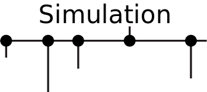

<p align="center">
    
</p>


The goal of Simulation is to provide a set of low level components which can be
used to write applications amenable to [FoundationDB style simulation testing](https://apple.github.io/foundationdb/testing.html).

Simulation is an abstraction over [Tokio], allowing application developers to write
applications which are generic over sources of nondeterminism. Additionally, Simulation
provides deterministic analogues to time, scheduling, network and IO.

## Scheduling and Time

Simulation provides a mock source of time. Mock time will only advance when the executor
has no more work to do. This can be used to force deterministic reordering of task execution.

When time is advanced, it is advanced instantly to a value which allows the executor to make
progress. Applications which rely on timeouts can then be tested in a fraction of the time it
would normally take to test a particular execution ordering.

## Network

Simulation includes an in-memory network. Applications can use `Environment::bind` and `Environment::connect`
to create in-memory connections between components. The in-memory connections will automatically have delays
and disconnect faults injected, dependent on an initial seed value.

## Faults

Faults are injected based on a seedable RNG, causing IO delays and disconnects.
This is sufficient to trigger bugs in higher level components, such as message reordering.

By eliminating sources of nondeterminism, and basing fault injection on a seedable RNG, it's
possible to run many thousands of tests in the span of a few seconds with different fault
injections. This allows testing different execution orderings. If a particular seed causes a
failing execution ordering, developers can use the seed value to debug and fix their applications.

Once the error is fixed, the seed value can be used to setup a regression test to ensure that the
issue stays fixed.

## Example

```rust
   use simulation::{Environment, TcpListener};
   use futures::{SinkExt, StreamExt};
   use std::{io, net, time};
   use tokio::codec::{Framed, LinesCodec};

   /// Start a client request handler which will write greetings to clients.
   async fn handle<E>(env: E, socket: <E::TcpListener as TcpListener>::Stream, addr: net::SocketAddr)
   where
       E: Environment,
   {
       // delay the response, in deterministic mode this will immediately progress time.
       env.delay_from(time::Duration::from_secs(1));
       println!("handling connection from {:?}", addr);
       let mut transport = Framed::new(socket, LinesCodec::new());
       if let Err(e) = transport.send(String::from("Hello World!")).await {
           println!("failed to send response: {:?}", e);
       }
   }

   /// Start a server which will bind to the provided addr and repyl to clients.
   async fn server<E>(env: E, addr: net::SocketAddr) -> Result<(), io::Error>
   where
       E: Environment,
   {
       let mut listener = env.bind(addr).await?;

       while let Ok((socket, addr)) = listener.accept().await {
           let request = handle(env.clone(), socket, addr);
           env.spawn(request)
       }
       Ok(())
   }


   /// Create a client which will read a message from the server
   async fn client<E>(env: E, addr: net::SocketAddr) -> Result<(), io::Error>
   where
       E: Environment,
   {
       loop {
           match env.connect(addr).await {
               Err(_) => {
                   // Sleep if the connection was rejected, retrying later.
                   // In deterministic mode, this will just reorder task execution
                   // without waiting for time to advance.
                   env.delay_from(time::Duration::from_secs(1)).await;
                   continue;
               }
               Ok(conn) => {
                   let mut transport = Framed::new(conn, LinesCodec::new());
                   let result = transport.next().await.unwrap().unwrap();
                   assert_eq!(result, "Hello World!");
                   return Ok(());
               }
           }
       }
   }
   #[test]
   fn test() {
       // This particular example will fail with a seed value of 22 due to not handling disconnects.
       let mut runtime = simulation::deterministic::DeterministicRuntime::new_with_seed(1).unwrap();
       let handle = runtime.handle();
       runtime.block_on(async {
           let bind_addr: net::SocketAddr = "127.0.0.1:8080".parse().unwrap();
           let server = server(handle.clone(), bind_addr);
           handle.spawn(async move {
               server.await.unwrap();
           });
           client(handle, bind_addr).await.unwrap();
       })
   }
```

[Tokio]: https://github.com/tokio-rs
[CurrentThread]:[tokio_executor::current_thread::CurrentThread]
[Delay]:[tokio_timer::Delay]
[Timeout]:[tokio_timer::Timeout]

License: MIT
